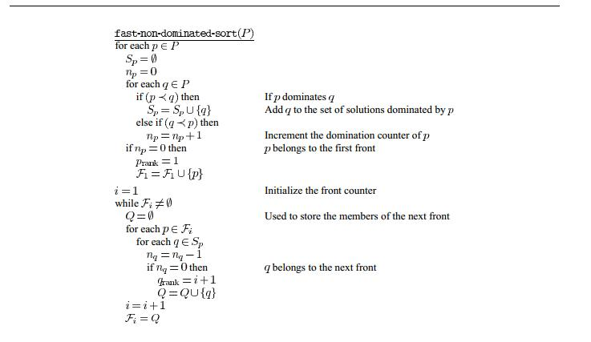
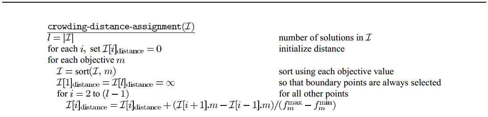
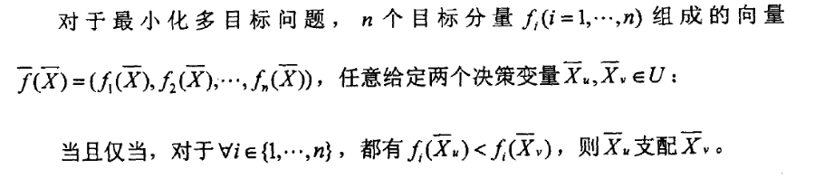

# 基于NSGAII的多目标聚类算法

## 基本概念
- **NSGA-II**: Non-dominated Sorting Genetic Algorithm-II
- **多目标聚类算法**：通过多种不同的聚类评价指标作为目标进行优化

## NSGA-II

#### 1. 快速非支配排序算子 
 
对种群中的所有个体循环求 **[pareto front(非支配解集)](https://baike.baidu.com/item/%E9%9D%9E%E6%94%AF%E9%85%8D%E8%A7%A3/6911808?fr=aladdin)**，第一组pareto front的非支配序为1，然后从种群中去掉，剩下的个体再求pareto front，这一组的非支配序为2，以此类推。

#### 2. 个体拥挤距离算子
 
首先，初始化每个个体的拥挤距离为0，对于每个目标函数，按照目标函数的适应值对个体排序，第一个个体和最后一个个体的拥挤距离等于无穷大，省下中间的个体用公式I[i]distance = I[i]distance

#### 3. 主循环
 
父代种群Pt进行crossover和mutation生成新的子代种群Qt，新种群Rt = Pt U Qt，对Rt 进行非支配排序和拥挤距离排序，筛选出新的父代Pt+1，筛选规则遵循： **个体i优于个体j，当且仅当，irank < jrank，或者， irank = jrank 且 idistance > jdistance**
## Pareto Front
> 多目标规划中，由于存在目标之间的冲突和无法比较的现象，一个解在某个目标上是最好的，在其他的目标上可能比较差。Pareto 在1986 年提出多目标的解不受支配解(Non-dominated set)的概念。其定义为：假设任何二解S1 及S2 对所有目标而言，S1均优于S2，则我们称S1 支配S2，若S1 的解没有被其他解所支配，则S1 称为非支配解（不受支配解），也称Pareto解。这些非支配解的集合即所谓的Pareto Front。所有坐落在Pareto front 中的所有解皆不受Pareto Front 之外的解（以及Pareto Front 曲线以内的其它解）所支配，因此这些非支配解较其他解而言拥有最少的目标冲突，可提供决策者一个较佳的选择空间。在某个非支配解的基础上改进任何目标函数的同时，必然会削弱至少一个其他目标函数。

## Pareto Dominance Relation

**翻译过来就是：**在多目标问题中，有两个解S1，S2，其中一个解S1的所有目标适应值都好过S2的，那么S1支配S2 

## 算法思想
首先，要写NSGA-II需要求出非支配序，而非支配序需要求出Pareto Front，可知，Pareto Front要判断支配关系，所以需要一个**支配关系算子**，支配关系算子的有两个输入，分别是两个解S1、S2，返回结果为布尔型，表示S1是否支配S2，算法思想就是对两个解的所有目标适应值进行比较，从而得出关系*（可运用逻辑关系设计成非支配关系算子，效率会提高）*。有了支配关系算子，就可以完成**非支配排序算子**，即从一个种群中选出非支配解集并且编上号，感觉并不需要写成独立算子，*（其实，并不需要全部求出，而是求一层放入精英池一层，放不下的话，后面的pareto front就不用求了）*具体实现再看。其次，NSGA-II需要一个**个体拥挤距离算子**，这个算子直接根据伪代码写出即可，不会有子算子，最后需要一个**算法主循环**，它包括**交叉算子**和**变异算子**，最后还需要一个能够把基因型转化成表现型的**目标函数算子**。所以综上所述，一共有：
* **算法主循环**
* **非支配排序算子**
* **个体拥挤距离算子**
* **支配关系算子**
* **交叉算子**
* **变异算子**
* **目标函数算子 * M**

## 个体基因编码
以记录个数为基因链，基因型为其被分到的类标号。*（聚类的类簇数量？）*

## 聚类的有效评价
根据维基百科所说，评价分为两类，外部评价(External evaluation,AKA *Given Label* )和内部评价(Internal evaluation, AKA *Not Given Label* )，聚类的评价指标(Not Given Label)基本可以分为类内和类间两方面来评价，类内紧致性(Compactness)表示类内各个点的聚拢效果，类间间隔性(Separation)表示不同类之间的分割程度。根据阅读的各种材料，各种评价指标基本遵循一种评价效果越好，其评价指标的计算就越复杂的准则。 
已知的评价指标：
* [Davies–Bouldin index](https://en.wikipedia.org/wiki/Davies%E2%80%93Bouldin_index) (戴维森堡丁指数)
* [Dunn index](https://en.wikipedia.org/wiki/Dunn_index) (邓恩指数)
* [Silhouette coefficient](https://en.wikipedia.org/wiki/Silhouette_(clustering)([轮廓系数](https://baike.baidu.com/item/%E8%BD%AE%E5%BB%93%E7%B3%BB%E6%95%B0/17361607?fr=aladdin))
* [new-index](file/一种基于连通性的聚类有效性评价指标.pdf)(一种基于连通性的聚类有效性评价指标)

#### new-index
根据论文[一种基于连通性的聚类有效评价指标.pdf](file/一种基于连通性的聚类有效性评价指标.pdf)，现存的各种评价指标都具有一定的缺陷，并提出一种较为有效的评价指标***new-index***。emmm...  
new-index虽然有优点，但是我觉得其时间复杂度太高，尤其是在计算两点联通距离的时候，时间复杂度非常大。
我们假设，每一个类所包含的点的平均数量为m那么。每个类需要计算点之间的距离$2m$次，每两个点之间的联通距离计算就需要选取最大值$\sum_{i=0}^{m-2}A_{m-2}^{i}$次，选取最小值1次。一个类的类内紧致性就需要$C_{m}^{2}\sum_{i=0}^{m-2}A_{m-2}^{i}$次最大值计算，$C_{m}^{2}$次最小值计算。假设我们聚类结果有k类，那么，就需要
$$2km$$次点距离计算。
$$kC_{m}^{2}\sum_{i=0}^{m-2}A_{m-2}^{i}$$次最大值计算。
$$kC_{m}^{2}$$次最小值计算。

## Reference
* [从NSGA到 NSGA II](http://www.cnblogs.com/bnuvincent/p/52s68786.html)
* [知乎-谁能通俗的讲解一下NSGA-II多目标遗传算法？](https://www.zhihu.com/question/26990498) 
* [NSGA-II 中文翻译](file/NSGA-II 中文翻译.pdf)
* [一种基于连通性的聚类有效性评价指标](file/一种基于连通性的聚类有效性评价指标.pdf)
* [Wikipedia-Pareto efficiency](https://en.wikipedia.org/wiki/Pareto_efficiency)
* [聚类算法评价指标](http://blog.csdn.net/sinat_33363493/article/details/52496011)
* [Wikipedia-Cluster analysis](https://en.wikipedia.org/wiki/Cluster_analysis#Internal_evaluation)
* [浅说Davies-Bouldin指数（DBI）](http://blog.sina.com.cn/s/blog_65c8baf901016flh.html)
* [Github Repository](https://github.com/MaxLeojh/NSGA-II)
